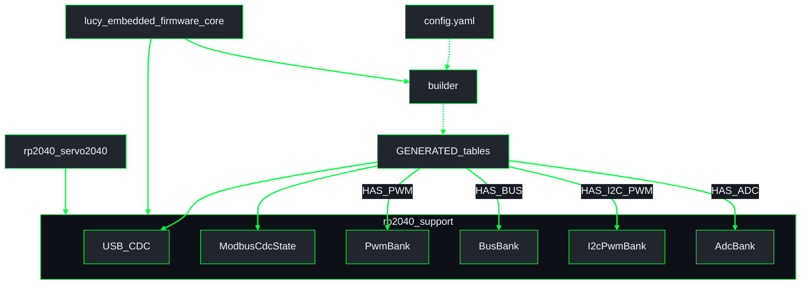
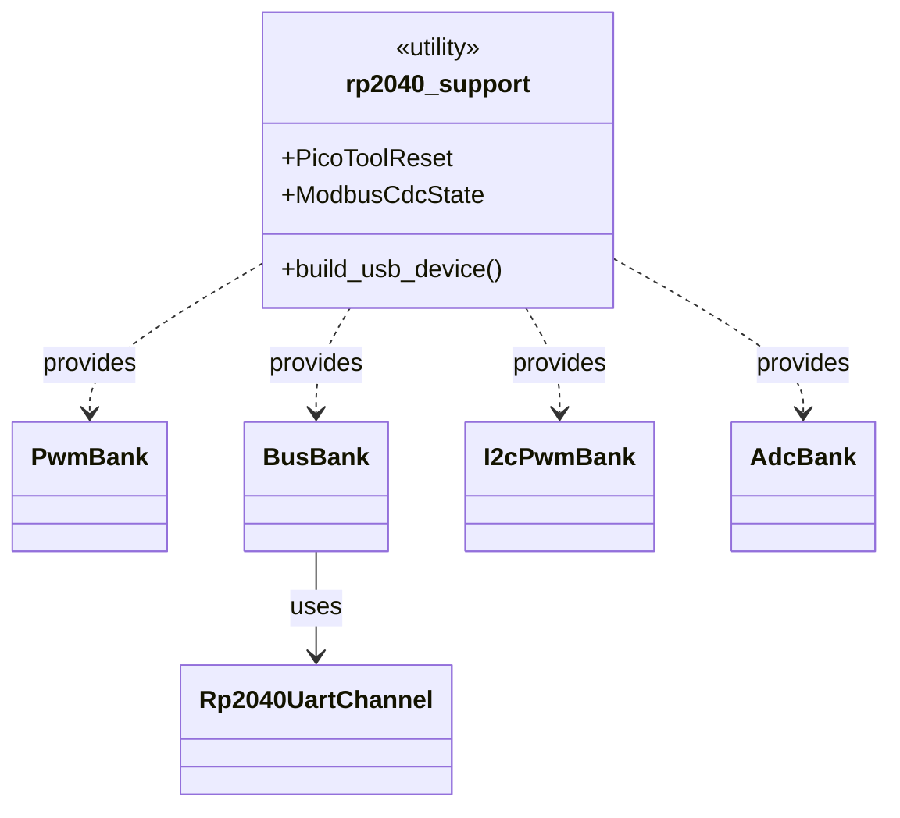

# Firmware architecture (one binary per board)

Detail for **`lucy_embedded_firmware`**.  
**System schematic:** [`lucy_ws/docs/architecture/overview.md`](../../../../docs/architecture/overview.md)  
**Index:** [`lucy_ws/docs/architecture/README.md`](../../../../docs/architecture/README.md)  
**Conventions:** [`lucy_ws/docs/architecture/GUIDE.md`](../../../../docs/architecture/GUIDE.md)

## Crate layout

**UML Component (firmware crates)** - YAML codegen into shared banks and thin board mains.

**UML Class (support banks)** - shared `rp2040_support` utilities and bank structs.

The `rp2040_support` crate box lists utilities (types + builder function) available
to all banks. Arrows show which bank structs the support crate provides, and which
peripheral drivers a bank uses (e.g., `BusBank` uses `Rp2040UartChannel`).

## Board → package

| Physical board | Package | Enabled banks (from robot YAML `board_class`) |
|----------------|---------|------------------------------------------------|
| Pimoroni Servo2040 | `rp2040_servo2040` | `internal_servo_only` → PWM `internal_servo_i2c_pwm` → PWM + I2C_PWM `bus_servo_only` → BUS |

One board → one firmware package → one UF2 per robot config. Robot YAML
`board_class` determines which device tables are generated; banks initialize
only when their `GENERATED_HAS_*` const is true (non-empty table).

## Codegen device tables

| Table | Hardware identity | Bank |
|-------|-------------------|------|
| `GENERATED_PWM_DEVICES` | `PwmGpio` (`ServoN`) | `PwmBank` |
| `GENERATED_BUS_DEVICES` | `UartBus` (`UART0:id`) | `BusBank` |
| `GENERATED_I2C_PWM_DEVICES` | `I2cPwm` (`I2C0:PCA9685:N`) | `I2cPwmBank` (placeholder HW) |
| `GENERATED_ADC_DEVICES` | `Adc` (`ADC0`…) | `AdcBank` (placeholder until ADC wired) |

## Register blocks

| Driver | Registers |
|--------|-----------|
| PwmServo / I2cPwm | 2 - cmd, angle (millirad) |
| BusServo | 3 - id, angle, cmd |
| PressureSensor | 2 - cmd, value |

## Related

- Firmware README: [`../../README.md`](../../README.md)
- Workspace overview: [`lucy_ws/docs/architecture/overview.md`](../../../../docs/architecture/overview.md)
- Architecture guide: [`lucy_ws/docs/architecture/GUIDE.md`](../../../../docs/architecture/GUIDE.md)
