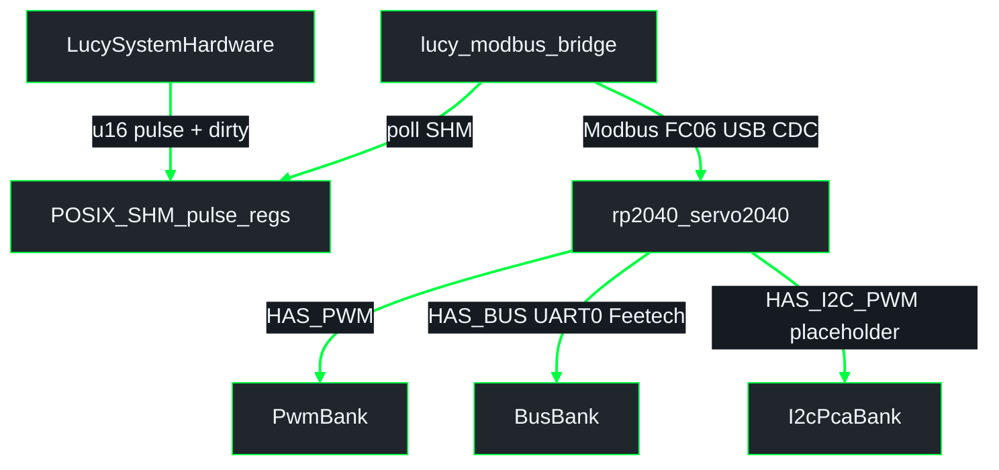
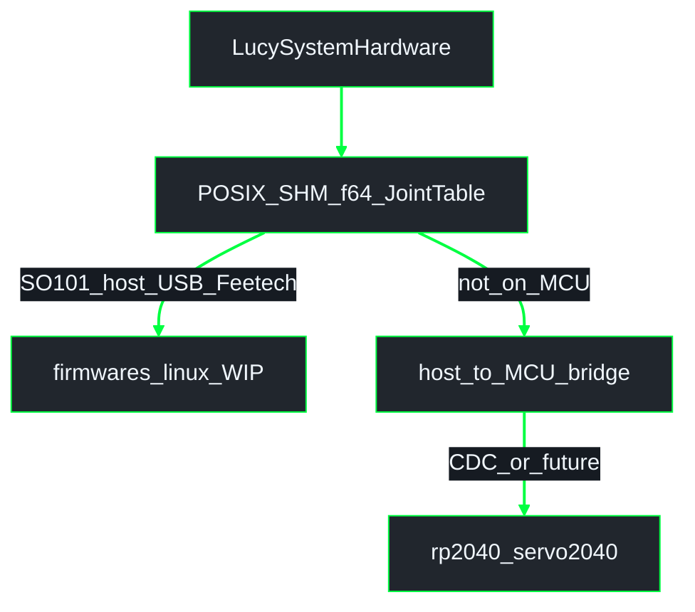
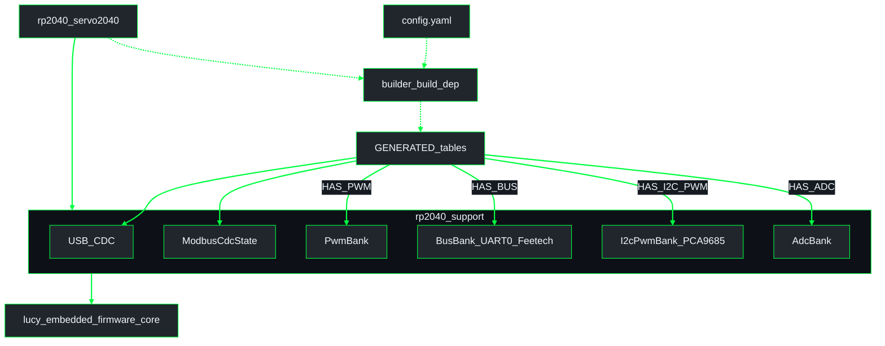
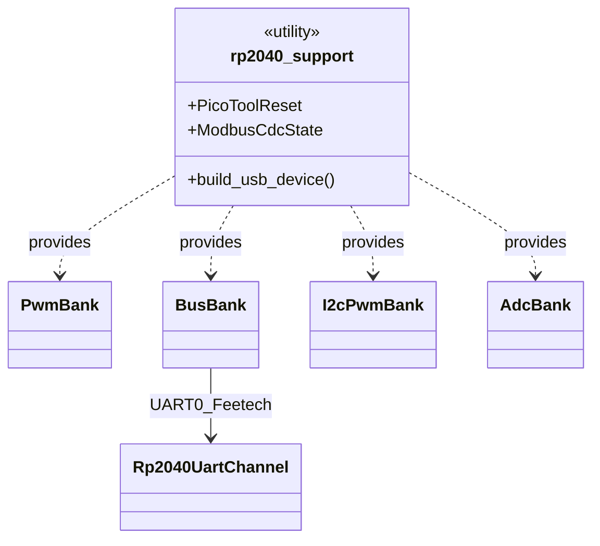

# Firmware architecture (one binary per board)

Detail for **`lucy_embedded_firmware`**.

**Workspace overview (when checked out under `lucy_ws/src/`):**  
[`lucy_control_panel/docs/architecture/overview.md`](../../../lucy_control_panel/docs/architecture/overview.md)  
**ROS pipeline / SHM:** [`lucy_ros_packages/docs/architecture/pipeline_shm.md`](../../../lucy_ros_packages/docs/architecture/pipeline_shm.md)  
**Index:** [README.md](README.md)

> **Branch note.** Schematics below describe the **Servo2040 unification** on `cma/fw-boards` (`rp2040_servo2040` + `rp2040_support`) and the **host Feetech** direction on WIP `mbo/feat-protocol`. This docs PR may sit on an older tree (`firmwares/rp2040`); treat package names as the intended tip, not necessarily files on this branch tip.

## Current vs target control paths

### What tips ship today (`cma/fw-boards` + ros Modbus tips)

Host `LucySystemHardware` writes **pulse `u16` dirty registers** in POSIX SHM; **`lucy_modbus_bridge`** (on ros `cma/pipeline-flash`) polls SHM and sends **Modbus RTU FC06 over USB CDC** to the RP2040. The MCU never mmaps host SHM.

| Robot / profile | Board path today |
|-----------------|------------------|
| **SO-ARM101** | `board_class: bus_servo_only` → `rp2040_servo2040` + `HAS_BUS` → **UART0** Feetech (GPIO0 TX, GPIO1 RX, GPIO2 DIR @ 1 Mbaud), still commanded via Modbus CDC |
| **InMoov** | Servo2040 PWM / I2C-PCA / ADC tables as YAML enables (I2C/ADC banks may still be Modbus placeholders until HW is wired) |

Feetech on the Servo2040 path is **UART half-duplex** (not “Bus” as a protocol). RX/position feedback on that UART channel is still limited on current tips (TX-oriented).

### Target (WIP — not on this PR / not end-to-end yet)

Align with m-brl: HI writes **`f64` radians** into POSIX SHM (`ActuatorSharedState` / `JointTable`). **Do not rebase** onto unfinished `mbo/feat-protocol` yet; match the contract when integrating.

| Consumer | Role | Status |
|----------|------|--------|
| `firmwares/linux` | Host process mmaps SHM → **USB serial** Feetech (SO-ARM101 alternate) | WIP on `mbo/feat-protocol` |
| Host bridge → RP2040 | Something must still carry commands to the MCU (today: Modbus; future: TBD / `mcu_bridge`) | **MCU cannot mmap SHM** |
| Servo2040 banks | Same UART0 Feetech / PWM / I2C profiles | Keep both SO101 Feetech options once host path lands |

**ABI caveat:** ros [#63](https://github.com/Lucy-Robotics/lucy_ros_packages/pull/63) `ActuatorSharedState` uses flat `double[MAX_ACTUATORS]` with `MAX_ACTUATORS=32`. Firmware `JointTable<N>` nests `CommandBlock` / `StateBlock` / `HeartbeatBlock`. Field sets match for the same `N`, but `firmwares/linux` currently maps `JointTable<6>` — not a drop-in overlay on N=32 without agreeing `N`.

## Crate layout (`cma/fw-boards`)

**UML Component** — YAML codegen into shared banks and thin board mains.

Cargo reality: **`rp2040_support` depends on `core`**; **`builder` is a build-dependency of the board firmware**, not of `core`.

**UML Class (support banks)**

Rust names: `BusBank` = UART0 Feetech/STS; `I2cPwmBank` = PCA9685 over **I2C** (PWM is on the expander). Builder **rejects** YAML that enables UART bus together with PWM on Servo1–3 (GPIO0–2), and rejects `UART` ≠ 0 on Servo2040.

## Board → package

| Physical board | Package | Enabled banks (from robot YAML `board_class`) |
|----------------|---------|------------------------------------------------|
| Pimoroni Servo2040 | `rp2040_servo2040` | `internal_servo_only` → PWM `internal_servo_i2c_pwm` → PWM + I2C PCA9685 `bus_servo_only` → UART0 Feetech (`HAS_BUS`) |

`board_class` is a **profile**; banks initialize only when `GENERATED_HAS_*` is true. PWM + UART0 can coexist only if PWM uses pads **outside** GPIO0–2 (builder-enforced).

## Codegen device tables

| Table | Hardware identity | Bank / wire |
|-------|-------------------|-------------|
| `GENERATED_PWM_DEVICES` | `PwmGpio` (`ServoN`) | `PwmBank` (RP2040 PWM) |
| `GENERATED_BUS_DEVICES` | `UartBus` (`UART0:id`) | `BusBank` → **UART0** half-duplex Feetech |
| `GENERATED_I2C_PWM_DEVICES` | `I2cPwm` (`I2C0:PCA9685:N`) | `I2cPwmBank` → **I2C** to PCA9685 (placeholder HW on some tips) |
| `GENERATED_ADC_DEVICES` | `Adc` (`ADC0`…) | `AdcBank` (placeholder until ADC wired) |

## Angles

| Layer | Unit today | Target |
|-------|------------|--------|
| Robot YAML / HI command interfaces | radians in YAML on rad tips | radians |
| Host SHM (Modbus tips) | pulse `u16` + dirty bits | — |
| Host SHM (WIP #63 / `JointTable`) | — | **`f64` rad** arrays + seq counters |
| Feetech ticks | driver maps rad ↔ STS ticks (`0…4095` typical) | unchanged |

## Related

- Firmware README: [`../../README.md`](../../README.md)
- Control-panel overview: [`../../../lucy_control_panel/docs/architecture/overview.md`](../../../lucy_control_panel/docs/architecture/overview.md)
- ROS pipeline / SHM: [`../../../lucy_ros_packages/docs/architecture/pipeline_shm.md`](../../../lucy_ros_packages/docs/architecture/pipeline_shm.md)
