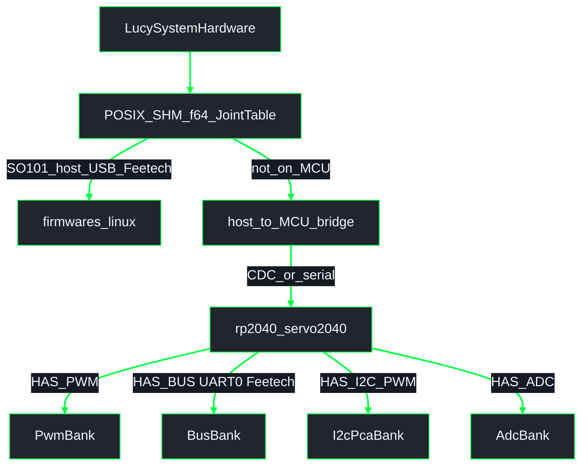
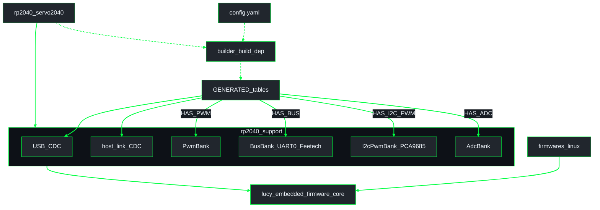
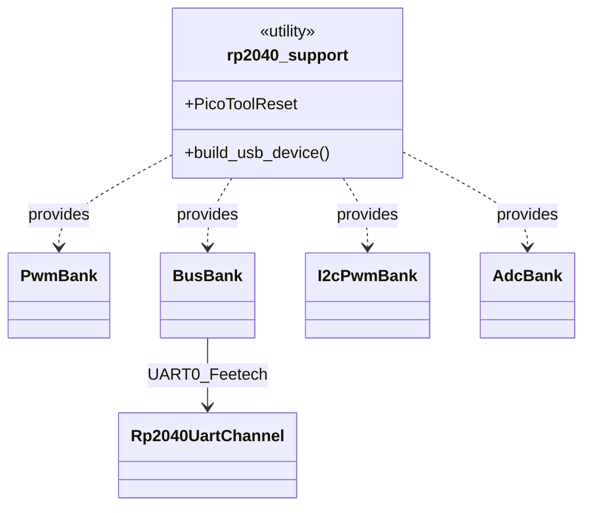

# Firmware architecture (one binary per board)

Detail for **`lucy_embedded_firmware`**.

**Workspace overview (when checked out under `lucy_ws/src/`):**  
[`lucy_control_panel/docs/architecture/overview.md`](../../../lucy_control_panel/docs/architecture/overview.md)  
**ROS pipeline / SHM:** [`lucy_ros_packages/docs/architecture/pipeline_shm.md`](../../../lucy_ros_packages/docs/architecture/pipeline_shm.md)  
**Index:** [README.md](README.md)

## Control path

Host `LucySystemHardware` writes **`f64` radians** into POSIX SHM (`ActuatorSharedState` / `JointTable`). The MCU never mmaps host SHM.

| Robot / profile | Path |
|-----------------|------|
| **SO-ARM101** | Prefer `firmwares/linux` mmaps SHM → **USB serial** Feetech. Alternate: Servo2040 `bus_servo_only` → UART0 Feetech behind the host↔MCU bridge. |
| **InMoov** | Servo2040 PWM / I2C-PCA / ADC profiles (`board_class`) behind the host↔MCU bridge. |

Feetech on Servo2040 is **UART half-duplex** (GPIO0 TX, GPIO1 RX, GPIO2 DIR @ 1 Mbaud) — not “Bus” as a protocol name beyond the bank type.

**ABI:** ros [`ActuatorSharedState`](https://github.com/Lucy-Robotics/lucy_ros_packages/pull/63) uses flat `double[MAX_ACTUATORS]` (`MAX_ACTUATORS=32`). Firmware `JointTable<N>` nests `CommandBlock` / `StateBlock` / `HeartbeatBlock`. Field sets match for the same `N`; agree `N` before overlaying host and MCU consumers.

## Crate layout

**UML Component** — YAML codegen into shared banks and thin board mains.

Cargo reality: **`rp2040_support` depends on `core`**; **`builder` is a build-dependency of the board firmware**, not of `core`. Host Feetech lives under `firmwares/linux` and mmaps the same SHM contract.

**UML Class (support banks)**

Rust names: `BusBank` = UART0 Feetech/STS; `I2cPwmBank` = PCA9685 over **I2C**. Builder **rejects** YAML that enables UART bus together with PWM on Servo1–3 (GPIO0–2), and rejects `UART` ≠ 0 on Servo2040.

## Board → package

| Physical board | Package | Enabled banks (from robot YAML `board_class`) |
|----------------|---------|------------------------------------------------|
| Pimoroni Servo2040 | `rp2040_servo2040` | `internal_servo_only` → PWM `internal_servo_i2c_pwm` → PWM + I2C PCA9685 `bus_servo_only` → UART0 Feetech (`HAS_BUS`) |
| Host (SO-ARM101) | `firmwares/linux` | USB serial Feetech from f64 SHM |

`board_class` is a **profile**; banks initialize only when `GENERATED_HAS_*` is true. PWM + UART0 can coexist only if PWM uses pads **outside** GPIO0–2 (builder-enforced).

## Codegen device tables

| Table | Hardware identity | Bank / wire |
|-------|-------------------|-------------|
| `GENERATED_PWM_DEVICES` | `PwmGpio` (`ServoN`) | `PwmBank` (RP2040 PWM) |
| `GENERATED_BUS_DEVICES` | `UartBus` (`UART0:id`) | `BusBank` → **UART0** half-duplex Feetech |
| `GENERATED_I2C_PWM_DEVICES` | `I2cPwm` (`I2C0:PCA9685:N`) | `I2cPwmBank` → **I2C** to PCA9685 |
| `GENERATED_ADC_DEVICES` | `Adc` (`ADC0`…) | `AdcBank` |

## Angles

| Layer | Unit |
|-------|------|
| Robot YAML / HI command interfaces | **radians** |
| Host SHM (`ActuatorSharedState` / `JointTable`) | **`f64` radians** + sequence counters |
| Feetech / PWM drivers | rad ↔ STS ticks or PWM pulse at the driver edge |

## Related

- Firmware README: [`../../README.md`](../../README.md)
- Control-panel overview: [`../../../lucy_control_panel/docs/architecture/overview.md`](../../../lucy_control_panel/docs/architecture/overview.md)
- ROS pipeline / SHM: [`../../../lucy_ros_packages/docs/architecture/pipeline_shm.md`](../../../lucy_ros_packages/docs/architecture/pipeline_shm.md)
