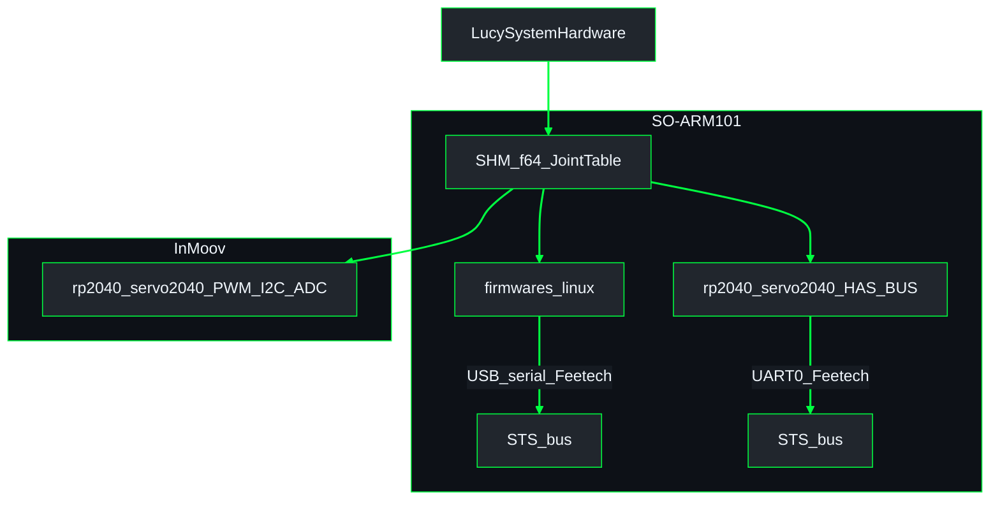
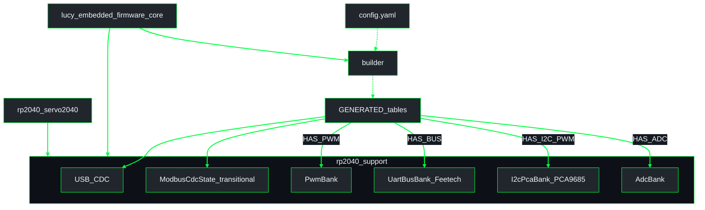
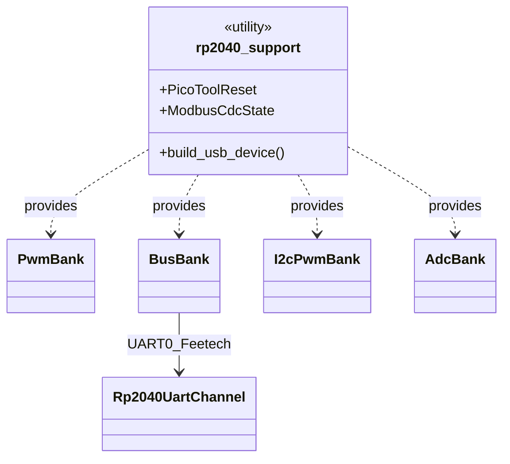

# Firmware architecture (one binary per board)

Detail for **`lucy_embedded_firmware`**.  
**System schematic:** [`lucy_ws/docs/architecture/overview.md`](../../../../docs/architecture/overview.md)  
**Index:** [`lucy_ws/docs/architecture/README.md`](../../../../docs/architecture/README.md)  
**Conventions:** [`lucy_ws/docs/architecture/GUIDE.md`](../../../../docs/architecture/GUIDE.md)

## Control paths by robot

Target host contract (shared with ROS HI): POSIX SHM **`JointTable` / `ActuatorSharedState`** with **`f64` radians** joint arrays and seq counters — not Modbus `u16` millirad registers. See [`lucy_ros_packages` pipeline / SHM](../../../../lucy_ros_packages/docs/architecture/pipeline_shm.md). Source of truth while WIP: `mbo/feat-protocol` (`crates/core/src/data.rs`) and ros [#63](https://github.com/Lucy-Robotics/lucy_ros_packages/pull/63).

| Robot | Feetech / output path | Board package |
|-------|----------------------|---------------|
| **SO-ARM101** | **Host direct** — `firmwares/linux` mmaps SHM and drives Feetech over **USB serial** (m-brl) | n/a (host process) |
| **SO-ARM101** | **Servo2040 UART** — same SHM contract → UF2 on Pimoroni Servo2040 → **UART0 half-duplex** Feetech (GPIO0 TX, GPIO1 RX, GPIO2 DIR @ 1 Mbaud) | `rp2040_servo2040` + `GENERATED_HAS_BUS` |
| **InMoov** | Servo2040 only — on-board **PWM**, **I2C PCA9685**, **ADC** as YAML enables | `rp2040_servo2040` (no host-direct Feetech) |

Both SO-ARM101 Feetech paths stay valid; robot YAML / package choice selects which binary runs. Do not delete either path when aligning with the HI f64 contract.

**Transitional:** some tips still speak Modbus RTU over USB CDC + millirad `u16` registers to the RP2040. That is not the architecture target; migrate toward the SHM f64 layout without rebasing onto unfinished `mbo/feat-protocol` WIP history.

## Crate layout

**UML Component (firmware crates)** - YAML codegen into shared banks and thin board mains.

**UML Class (support banks)** - shared `rp2040_support` utilities and bank structs.

Rust type names today: `BusBank` (UART0 Feetech / STS), `I2cPwmBank` (PCA9685 over I2C — PWM is on the expander, not the RP2040 pin mode). Diagram labels prefer the wire protocol.

## Board → package

| Physical board | Package | Enabled banks (from robot YAML `board_class`) |
|----------------|---------|------------------------------------------------|
| Pimoroni Servo2040 | `rp2040_servo2040` | `internal_servo_only` → PWM `internal_servo_i2c_pwm` → PWM + I2C PCA9685 `bus_servo_only` → UART0 Feetech (`HAS_BUS`) |

One board → one firmware package → one UF2 per robot config. Robot YAML
`board_class` is a **profile** of usual channel layout; banks initialize
only when their `GENERATED_HAS_*` const is true (non-empty device table).
PWM + UART bus can coexist if YAML enables both and GPIO0–2 are not
double-booked as PWM Servo1–3.

## Codegen device tables

| Table | Hardware identity | Bank / wire |
|-------|-------------------|-------------|
| `GENERATED_PWM_DEVICES` | `PwmGpio` (`ServoN`) | `PwmBank` (RP2040 PWM) |
| `GENERATED_BUS_DEVICES` | `UartBus` (`UART0:id`) | `BusBank` → **UART0** half-duplex Feetech |
| `GENERATED_I2C_PWM_DEVICES` | `I2cPwm` (`I2C0:PCA9685:N`) | `I2cPwmBank` → **I2C** to PCA9685 |
| `GENERATED_ADC_DEVICES` | `Adc` (`ADC0`…) | `AdcBank` |

## Angles and host interface

| Layer | Unit / layout |
|-------|----------------|
| Robot YAML / HI command interfaces | **radians** (`f64` / `double`) |
| Target SHM (`JointTable` / `ActuatorSharedState`) | `hw_commands[]`, `hw_positions[]`, … as **`f64` rad** + `command_seq` / `state_seq` / `heartbeat` |
| Transitional Modbus register path | still millirad `u16` on some tips — retire toward f64 SHM |

Feetech STS tick mapping stays in the driver (`0…2π` ↔ `0…4096` ticks where configured); do not reintroduce millirad as the SHM contract.

## Related

- Firmware README: [`../../README.md`](../../README.md)
- Workspace overview: [`lucy_ws/docs/architecture/overview.md`](../../../../docs/architecture/overview.md)
- Architecture guide: [`lucy_ws/docs/architecture/GUIDE.md`](../../../../docs/architecture/GUIDE.md)
